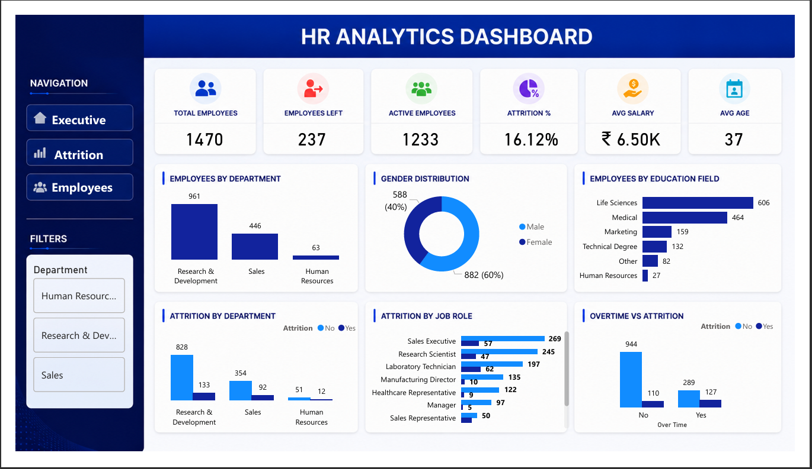
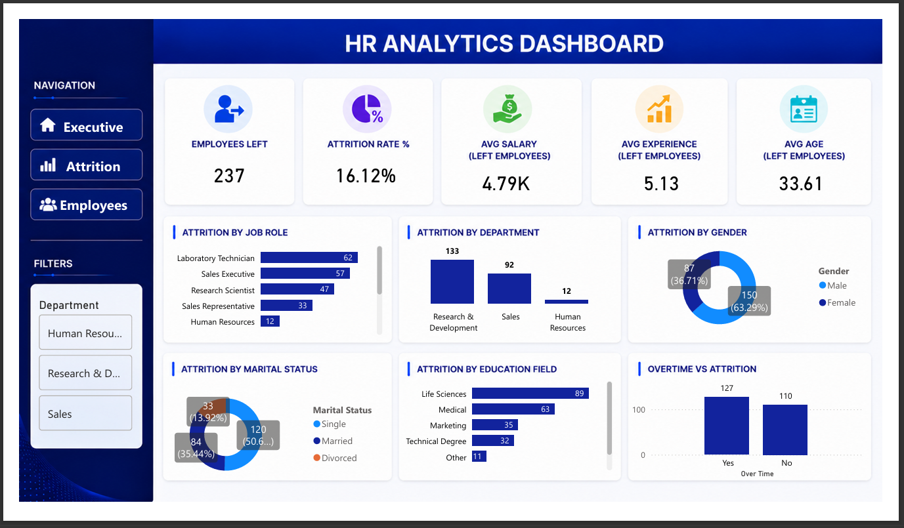

# HR Analytics Dashboard | Power BI

## 📌 Project Overview

This project presents an interactive HR Analytics Dashboard built in **Power BI** to analyze employee data and uncover workforce trends. The dashboard helps HR teams monitor employee attrition, department performance, demographics, salary insights, and overtime impact for better decision-making.

---

## Dashboard Features

### Executive Summary
- Total Employees
- Active Employees
- Employees Left
- Attrition Rate
- Average Salary
- Average Age
- Department-wise Employee Distribution
- Gender Distribution
- Education Field Distribution
- Overtime Analysis

### Attrition Analysis
- Attrition by Department
- Attrition by Job Role
- Attrition by Gender
- Attrition by Marital Status
- Attrition by Education Field
- Overtime vs Attrition
- Average Salary of Employees Left
- Average Experience of Employees Left
- Average Age of Employees Left

---

## Tools Used

- Microsoft Power BI
- Power Query
- DAX
- Data Modeling
- Data Cleaning
- Interactive Visualizations

---

## Dataset

IBM HR Analytics Employee Attrition Dataset (Kaggle)

https://www.kaggle.com/datasets/pavansubhasht/ibm-hr-analytics-attrition-dataset

---

## Key Insights

### Workforce Overview

- Total workforce consists of **1,470 employees**.
- **1,233 employees remain active**, while **237 employees have left**.
- Overall attrition rate stands at **16.12%**.

---

### Department Insights

- Research & Development has the largest workforce (**961 employees**).
- Sales follows with **446 employees**.
- Human Resources has the smallest workforce (**63 employees**).
- R&D also records the highest number of employee exits (**133**), followed by Sales (**92**).

---

### Job Role Insights

Highest employee attrition occurs in:

- Laboratory Technician (62)
- Sales Executive (57)
- Research Scientist (47)
- Sales Representative (33)

These job roles may require improved retention strategies.

---

### Gender Analysis

- Workforce consists of **60% Male** and **40% Female**.
- Employees leaving:
  - Male: **150**
  - Female: **87**
- Male employees contribute to a larger share of overall attrition.

---

### Marital Status Analysis

Among employees who left:

- Single employees show the highest attrition.
- Married employees have moderate attrition.
- Divorced employees represent the smallest attrition group.

---

### Education Field Analysis

Most attrition is observed among employees from:

- Life Sciences
- Medical
- Marketing

Human Resources education background has the lowest attrition.

---

### Salary & Experience

Employees who left have:

- Average Salary: **₹4.79K**
- Average Experience: **5.13 Years**
- Average Age: **33.61 Years**

This suggests attrition is more common among relatively early-career employees.

---

### Overtime Analysis

Employees working overtime show noticeably higher attrition compared to those who do not.

Reducing excessive overtime may help improve employee retention.

---

## Dashboard Screenshots

### Executive Summary



---

### Attrition Analysis



---

## Project Structure

```
HR-Analytics-PowerBI/
│
├── Dashboard/
│   └── HR Analytics Dashboard.pbix
│
├── Dataset/
│   └── HR_Analytics.csv
│
├── screenshots/
│   ├── executive-summary.png
│   └── attrition-analysis.png
│

```

---

## Skills Demonstrated

- Data Cleaning
- Power Query Transformations
- DAX Measures
- Data Modeling
- Interactive Dashboard Design
- KPI Development
- HR Analytics
- Business Intelligence
- Data Visualization

---

## Future Improvements

- Drill-through reports
- Employee-level analysis page
- Predictive attrition forecasting
- Department performance KPIs
- Hiring trend analysis

---

## Author

**Raghuram**

If you found this project useful, consider giving it a ⭐ on GitHub.
